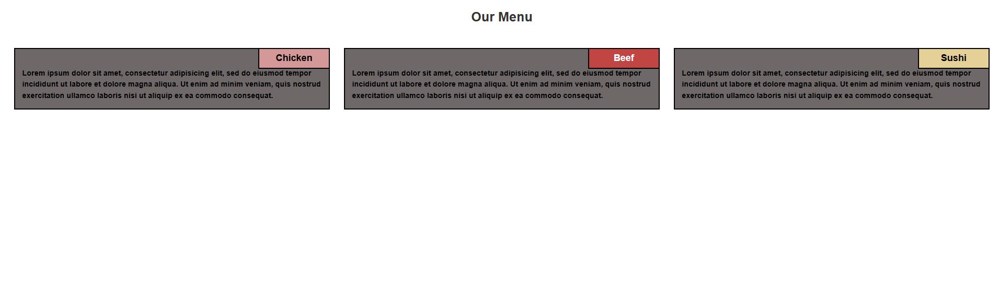
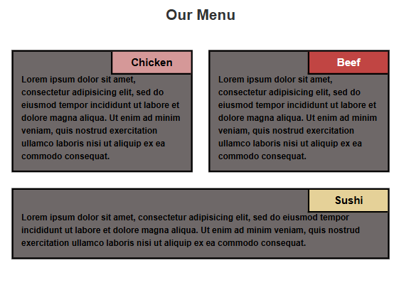
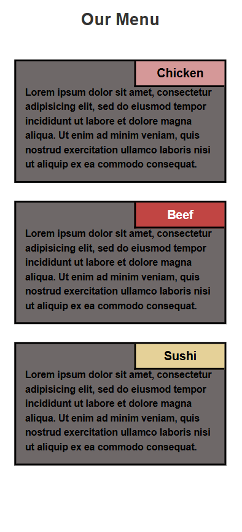

# module2-solution
Responsive menu page with mobile, tablet &amp; desktop layouts. Three food sections adapt to screen size using CSS media queries. No frameworks used.

**Live Site:** [Our Menu](https://njayamanne.github.io/module2-solution/)

## 📸 Preview

### Desktop View

### Tablet View  

### Mobile View

